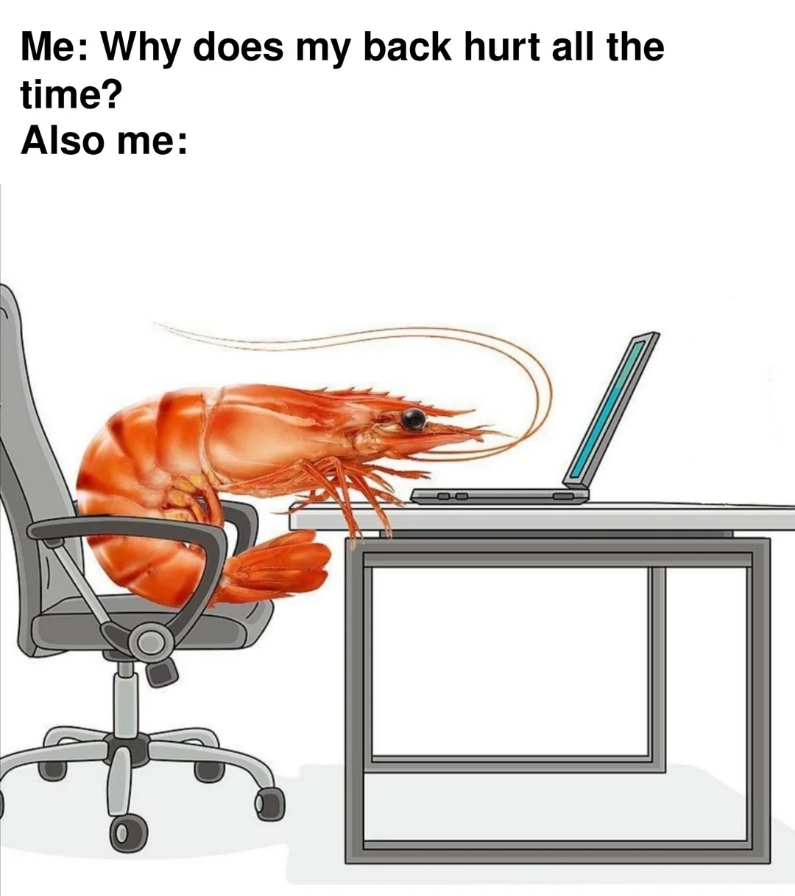

# 🧘‍♀️stretchOS

> _*This is somewhat similar to my [battery-monitor](https://github.com/Jessica-Tslv/battery_monitor) program, this is a shell script that runs in a Terminal window. It generates regular pop-up reminders on your screen, helping you to make healthier decisions.*_

> _*It was insipired by my consistent shrimp posture and zombie focus. Dropdown for visual representation of me below.*_

<details>
  <summary> What inspired this</summary>
    
</details>

<br>
stretchOS is a lightweight Bash program that periodically reminds you to:

- stand up and move 🚶‍♀️
- drink water 💧
- fix your posture 🦴
- acknowledge reality 🌳

---

## ✨ Features

- 🟢 Green ASCII booting-like screen (because aesthetics matter of course)
- 🔔 Randomized reminder messages
- ⏱️ Runs continuously in the background using very little resources
- 😈 Slightly judgmental tone for maximum effectiveness

---

## 🚀 Getting Started

### 1. Clone the repo

```bash
git clone https://github.com/yourusername/stretchOS.git
cd stretchOS
```

---

### 2. Make it executable

```bash
chmod +x stretchOS.sh
```

---

### 3. Run it

```bash
./stretchOS.sh
```

---

## How It Works

Every 20 minutes:

- Picks a random message
- Sends a system notification

---

## Requirements

- macOS
- Terminal with Bash

---

## ⚙️ Customisation

It can be adjusted to suit prefences.

### Change reminder interval

```bash
sleep 20m
```

---

### Edit messages

Modify the `messages` array:

```bash
messages=(
...
)
```

---

## To stop stretchOS

Press:

```bash
Ctrl + C
```

(though stretchOS strongly discourages this decision)

---

## 📸 Preview

To be added

---

## ⚖️ Disclaimer

stretchOS is not responsible for:

- improved posture
- increased hydration
- existential awareness

Results may vary.

---

Pull requests welcome.

Your spine will thank you.
